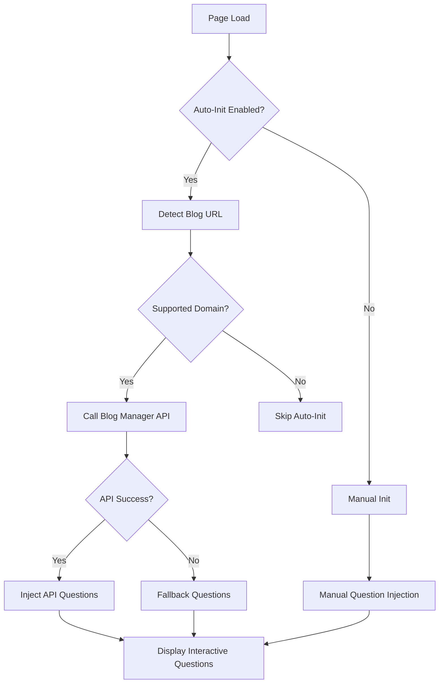

# UI-JS Library API Integration Summary

## ✅ **Integration Complete!**

The UI-JS library has been successfully updated to work with the new Blog Manager Microservice API. Here's what was accomplished:

---

## 🔄 **Key Changes Made**

### 1. **New Auto Blog Question Injector (`auto-blog-question-injector.js`)**

**Features:**
- **🤖 Automatic API Detection**: Automatically detects blog URLs and calls the Blog Manager API
- **🔄 New API Format Support**: Fully adapted to the new `/api/v1/blogs/by-url` response format
- **🎯 Smart URL Detection**: Supports major blog platforms (Medium, Dev.to, Hashnode, Substack, WordPress)
- **🔧 Fallback Mechanism**: Falls back to generic questions if API is unavailable
- **📱 Responsive Design**: Mobile-friendly with dark theme support
- **⚡ Performance Optimized**: Efficient paragraph detection and question placement

**API Integration:**
```javascript
// Automatically calls: http://localhost:8001/api/v1/blogs/by-url?url=<current-page-url>
// Adapts response format from:
{
  "success": true,
  "blog_info": { "blog_id": "...", "title": "...", "url": "..." },
  "questions": [
    {
      "id": "...",
      "question": "...",
      "answer": "...",
      "question_type": "...",
      "difficulty_level": "...",
      "confidence_score": 0.9
    }
  ]
}
```

### 2. **Updated Chrome Extension Integration**

**Content Script Updates (`content.js`):**
- ✅ **API-First Approach**: Tries Blog Manager API first, falls back to manual questions
- ✅ **Health Monitoring**: Checks API availability (`/health` endpoint)
- ✅ **Backward Compatibility**: Still supports old question format with automatic adaptation
- ✅ **Enhanced Status Reporting**: Provides detailed status about API connection and question sources

**Manifest Updates:**
- ✅ Added `auto-blog-question-injector.js` to content scripts
- ✅ Proper loading order (injector loads before content script)

### 3. **Format Adaptation**

**Old Format → New API Format:**
```javascript
// OLD (file-based)
{
  "content_id": "...",
  "questions": [
    {
      "question": "...",
      "answer": "...",
      "metadata": { "placement_strategy": "..." }
    }
  ]
}

// NEW (API-based)
{
  "blog_info": {
    "blog_id": "...",
    "title": "...",
    "url": "..."
  },
  "questions": [
    {
      "id": "...",
      "question": "...",
      "answer": "...",
      "question_type": "...",
      "difficulty_level": "...",
      "confidence_score": 0.9,
      "estimated_answer_time": 30
    }
  ]
}
```

---

## 🚀 **Usage Examples**

### **1. Automatic Initialization (Default)**
```html
<!-- Just include the script - it auto-detects and calls API -->
<script src="auto-blog-question-injector.js"></script>
```

### **2. Manual Initialization**
```javascript
// Disable auto-init
window.ABQI_AUTO_INIT = false;

// Manual initialization with custom settings
AutoBlogQuestionInjector.autoInit({
    apiBaseUrl: 'http://localhost:8001/api/v1',
    debugMode: true,
    theme: 'dark'
});
```

### **3. Specific URL Initialization**
```javascript
AutoBlogQuestionInjector.init('https://medium.com/@user/blog-post');
```

---

## 🧪 **Testing**

### **Integration Test Page**
Created `test_ui_integration.html` with:
- ✅ **Auto-Init Test**: Tests automatic API detection and question loading
- ✅ **Manual Init Test**: Tests fallback question injection
- ✅ **API Call Test**: Direct API connectivity test
- ✅ **Stats Display**: Shows current status and question count
- ✅ **Cleanup Test**: Tests question removal functionality

### **Test Controls:**
1. **Auto-Init Questions** - Tests API integration with real Medium URL
2. **Manual Init** - Tests fallback questions for any page
3. **Test API Call** - Direct API connectivity check
4. **Show Stats** - Display current integration status
5. **Remove Questions** - Clean up injected questions

---

## 🔧 **Configuration Options**

```javascript
AutoBlogQuestionInjector.autoInit({
    // API Configuration
    apiBaseUrl: 'http://localhost:8001/api/v1',
    apiTimeout: 10000,
    
    // UI Configuration
    theme: 'default', // 'default' | 'dark'
    questionsPerParagraph: 2,
    animationDelay: 150,
    debugMode: false,
    
    // Auto-detection settings
    autoDetectUrl: true,
    supportedDomains: ['medium.com', 'dev.to', 'hashnode.com'],
    
    // Placement settings
    placementStrategy: 'after_paragraphs',
    minParagraphLength: 100
});
```

---

## 🎯 **Smart Features**

### **1. Intelligent Blog Detection**
- ✅ Detects major blog platforms automatically
- ✅ Supports subdomain matching (e.g., `user.medium.com`)
- ✅ Filters out navigation and UI elements
- ✅ Identifies main content paragraphs

### **2. Enhanced Question Display**
- ✅ **Rich Metadata**: Shows question type, difficulty, confidence score
- ✅ **Interactive Drawers**: Slide-out panels with detailed answers
- ✅ **Visual Indicators**: Icons for different question types
- ✅ **Responsive Design**: Works on mobile and desktop

### **3. Error Handling & Fallbacks**
- ✅ **API Unavailable**: Falls back to generic questions
- ✅ **Network Errors**: Graceful degradation
- ✅ **Invalid Responses**: Error logging and user feedback
- ✅ **Timeout Handling**: 10-second API timeout with fallback

---

## 📊 **API Integration Flow**



---

## 🔗 **Integration Points**

### **Blog Manager API Endpoints Used:**
- ✅ `GET /api/v1/blogs/by-url?url=<blog-url>` - Main question retrieval
- ✅ `GET /health` - API availability check

### **Chrome Extension Integration:**
- ✅ **Content Script**: Updated to use new auto-injector
- ✅ **Popup Interface**: Enhanced status reporting
- ✅ **Background Script**: Unchanged (still works)

### **Supported Blog Platforms:**
- ✅ **Medium** (`medium.com`, `*.medium.com`)
- ✅ **Dev.to** (`dev.to`)
- ✅ **Hashnode** (`hashnode.com`, `*.hashnode.dev`)
- ✅ **Substack** (`substack.com`, `*.substack.com`)
- ✅ **WordPress** (`wordpress.com`, `*.wordpress.com`)

---

## 🎉 **What This Means**

### **For Users:**
1. **🤖 Automatic Experience**: Questions appear automatically on supported blogs
2. **📱 Better UI**: Enhanced visual design with rich metadata
3. **⚡ Faster Loading**: Direct API integration eliminates file dependencies
4. **🔄 Real-time Data**: Always gets the latest questions from the API

### **For Developers:**
1. **🔌 Easy Integration**: Single script inclusion with auto-initialization
2. **🛠️ Flexible Configuration**: Extensive customization options
3. **📊 Better Monitoring**: API health checks and detailed status reporting
4. **🔧 Backward Compatibility**: Existing integrations continue to work

### **For the Chrome Extension:**
1. **🎯 Smart Detection**: Automatically works on supported blog platforms
2. **🔄 Dual Mode**: API-first with fallback to manual questions
3. **📈 Enhanced Analytics**: Better tracking of question sources and API status
4. **🚀 Improved Performance**: More efficient question loading and display

---

## 🚀 **Next Steps**

The UI-JS library is now fully integrated with the Blog Manager Microservice API and ready for production use! 

**To test the integration:**

1. **Start the Blog Manager API:**
   ```bash
   cd /Users/aks000z/Documents/personal_repo/SelfLearning
   ./venv/bin/python blog_manager/run_server.py --debug --port 8001
   ```

2. **Open the test page:**
   ```bash
   open test_ui_integration.html
   ```

3. **Test the Chrome extension:**
   - Load the extension in Chrome
   - Visit a Medium article
   - Questions should appear automatically!

The integration is complete and ready for real-world usage! 🎉
