# End-to-End Flow Documentation - Visual Diagrams

This document shows the complete execution flow for each endpoint using visual flow diagrams.

---

## Router: `blogs_router.py` (`/api/v1/jobs`)

### Endpoint 1: `POST /api/v1/jobs/process` - Enqueue Blog Processing

```mermaid
graph TD
    A[HTTP POST Request<br/>JobCreateRequest] --> B[Router: enqueue_blog_processing &lpar;blogs_router.py&rpar;]
    B --> C{Extract request_id<br/>from middleware &lpar;blogs_router.py&rpar;}
    C --> D[Dependency Injection<br/>get_current_publisher &lpar;auth.py&rpar;]
    D --> E{Validate<br/>X-API-Key &lpar;auth.py&rpar;}
    E -->|Invalid| F[HTTPException 401 &lpar;blogs_router.py&rpar;]
    E -->|Valid| G[Get Publisher Object &lpar;auth.py&rpar;]
    G --> H[Dependency Injection<br/>Get Repositories &lpar;deps.py&rpar;]
    H --> I[Service: validate_blog_url_domain &lpar;auth_service.py&rpar;]
    I --> J{Domain Match? &lpar;auth_service.py&rpar;}
    J -->|No| K[HTTPException 403 &lpar;auth_service.py&rpar;]
    J -->|Yes| L[Instantiate BlogService &lpar;blogs_router.py&rpar;]
    L --> M[Service: enqueue_blog_processing &lpar;blog_service.py&rpar;]
    
    M --> N[Normalize URL &lpar;blog_service.py&rpar;]
    N --> O{Daily Limit<br/>Check &lpar;blog_service.py&rpar;}
    O -->|Exceeded| P[HTTPException 429 &lpar;blog_service.py&rpar;]
    O -->|OK| Q[Check Existing Blog &lpar;blog_service.py&rpar;]
    Q --> R{Blog Exists? &lpar;blog_service.py&rpar;}
    R -->|Yes, Completed| S[Return Existing Job<br/>Status 200 &lpar;blog_service.py&rpar;]
    R -->|No or Not Completed| T[Check Whitelist &lpar;publisher_service.py&rpar;]
    T --> U{Whitelisted? &lpar;publisher_service.py&rpar;}
    U -->|No| V[HTTPException 403 &lpar;publisher_service.py&rpar;]
    U -->|Yes| W[Repository: reserve_blog_slot &lpar;publisher_repository.py&rpar;]
    W --> X{Atomic Lock<br/>Check Limit &lpar;publisher_repository.py&rpar;}
    X -->|Exceeded| Y[UsageLimitExceededError &lpar;publisher_repository.py&rpar;]
    X -->|OK| Z[Increment<br/>blog_slots_reserved &lpar;publisher_repository.py&rpar;]
    Z --> AA[Repository: create_job &lpar;job_repository.py&rpar;]
    AA --> AB{Job Already<br/>Queued? &lpar;job_repository.py&rpar;}
    AB -->|Yes| AC[Return Existing Job ID &lpar;job_repository.py&rpar;]
    AB -->|No| AD[Generate UUID &lpar;job_repository.py&rpar;]
    AD --> AE[Insert Job to MongoDB<br/>status: QUEUED &lpar;job_repository.py&rpar;]
    AE --> AF[Repository: get_job_by_id &lpar;job_repository.py&rpar;]
    AF --> AG[Build JobStatusResponse &lpar;blog_service.py&rpar;]
    AG --> AH[Return Status 202 &lpar;blogs_router.py&rpar;]
    
    style A fill:#cce5ff
    style B fill:#cce5ff
    style C fill:#cce5ff
    style F fill:#cce5ff
    style H fill:#cce5ff
    style L fill:#cce5ff
    style AH fill:#cce5ff
    style I fill:#fff4e1
    style J fill:#fff4e1
    style M fill:#ffe6cc
    style N fill:#ffe6cc
    style O fill:#ffe6cc
    style Q fill:#ffe6cc
    style R fill:#ffe6cc
    style S fill:#ffe6cc
    style T fill:#fff4e1
    style U fill:#fff4e1
    style AG fill:#ffe6cc
    style W fill:#e6d5ff
    style X fill:#e6d5ff
    style Z fill:#e6d5ff
    style AA fill:#e6d5ff
    style AB fill:#e6d5ff
    style AC fill:#e6d5ff
    style AD fill:#e6d5ff
    style AF fill:#e6d5ff
    style AE fill:#d5ffe6
```

#### Detailed Flow Steps:

**Router Layer:**
1. Receive HTTP POST with `blog_url`
2. Extract `request_id` from middleware
3. Authenticate publisher via `get_current_publisher` (X-API-Key)
4. Inject repositories (JobRepository, PublisherRepository)
5. Validate domain: `validate_blog_url_domain()`
6. Call service: `BlogService.enqueue_blog_processing()`

**Service Layer:**
1. Normalize URL
2. **Daily Limit Check** → Query MongoDB for completed jobs today
3. **Existing Blog Check** → Query MongoDB `raw_blog_content` collection
4. **Whitelist Check** → `PublisherService.ensure_url_whitelisted()`
5. **Reserve Slot** → `PublisherRepository.reserve_blog_slot()` (atomic)
6. **Create Job** → `JobRepository.create_job()` (check duplicates, insert)
7. Build response and return

**Repository Layer:**
- **reserve_blog_slot**: PostgreSQL row lock, check limit, increment counter
- **create_job**: MongoDB duplicate check, insert new job document

---

### Endpoint 2: `GET /api/v1/jobs/status/{job_id}` - Get Job Status

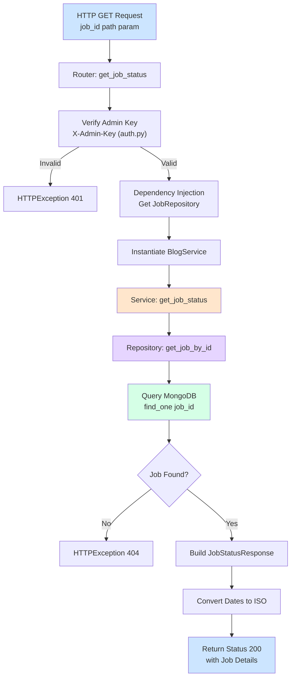

---

### Endpoint 3: `GET /api/v1/jobs/stats` - Get Queue Statistics

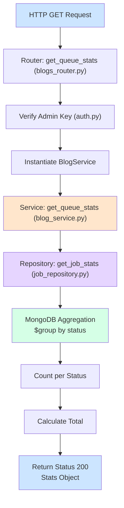

---

### Endpoint 4: `POST /api/v1/jobs/cancel/{job_id}` - Cancel Job

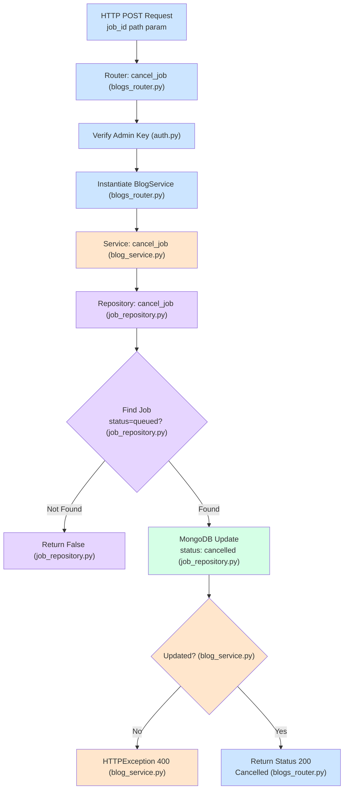

---

## Router: `questions_router.py` (`/api/v1/questions`)

### Endpoint 1: `GET /api/v1/questions/check-and-load` - Smart Question Loading

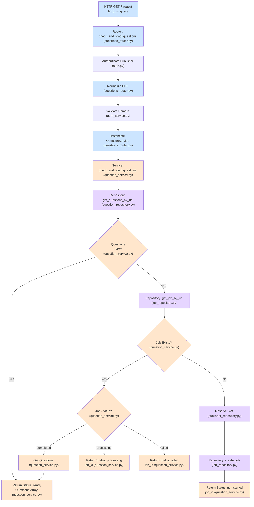

---

### Endpoint 2: `GET /api/v1/questions/by-url` - Get Questions by URL

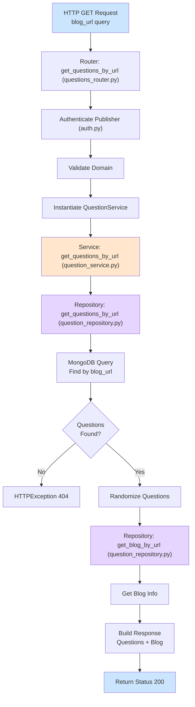

---

### Endpoint 3: `GET /api/v1/questions/{question_id}` - Get Question by ID

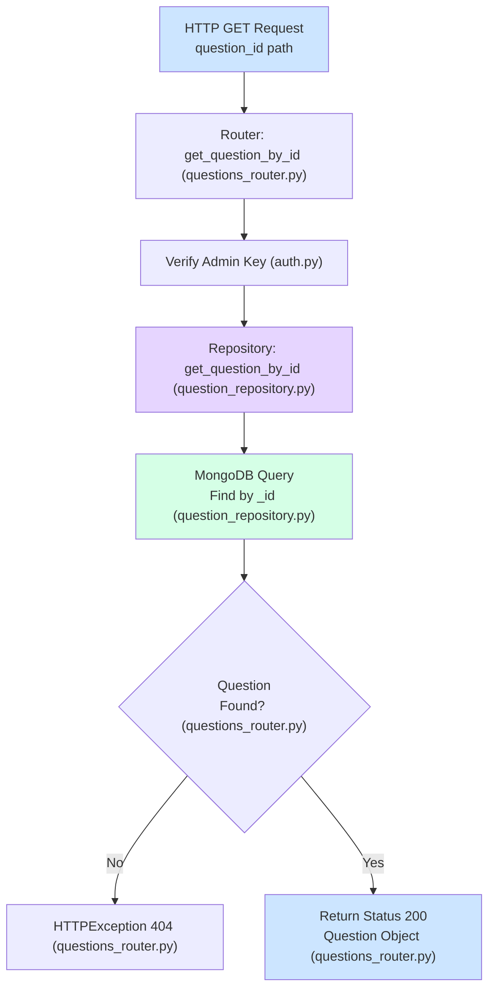

---

### Endpoint 4: `DELETE /api/v1/questions/{blog_id}` - Delete Blog

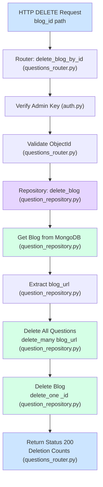

---

## Router: `search_router.py` (`/api/v1/search`)

### Endpoint 1: `POST /api/v1/search/similar` - Find Similar Blogs

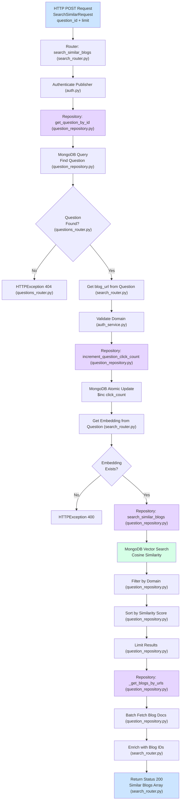

---

## Router: `qa_router.py` (`/api/v1/qa`)

### Endpoint 1: `POST /api/v1/qa/ask` - Answer Question with LLM

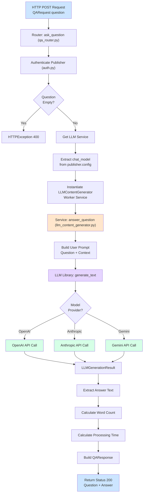

**Note:** This endpoint has a dependency on Worker Service's `LLMContentGenerator`, which uses the standalone `llm_providers_library`.

---

## Router: `publishers_router.py` (`/api/v1/publishers`)

### Endpoint 1: `POST /api/v1/publishers/onboard` - Create Publisher

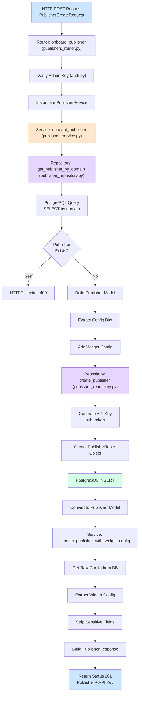

---

### Endpoint 2: `GET /api/v1/publishers/metadata` - Get Publisher Metadata (Public)

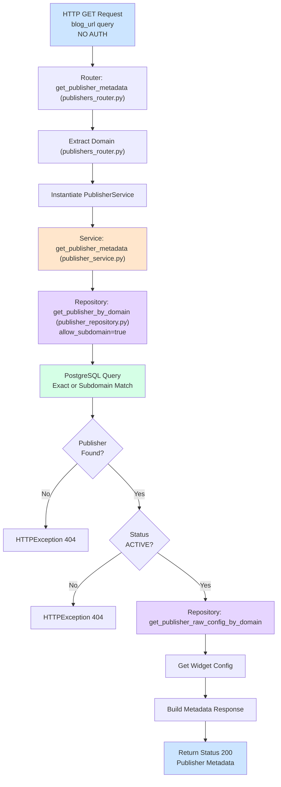

---

## Layer Responsibilities Summary

### Router Layer (HTTP Boundary)
- ✅ Request parsing and validation
- ✅ Authentication (via dependencies)
- ✅ Dependency injection (repositories/services)
- ✅ Response formatting (standardized JSON)
- ✅ Error handling → HTTP exceptions

### Service Layer (Business Logic)
- ✅ Business rules enforcement
- ✅ Cross-repository coordination
- ✅ Transaction management
- ✅ Data transformation (dict ↔ models)
- ✅ Validation and constraint checking

### Repository Layer (Data Access)
- ✅ Database operations (CRUD)
- ✅ Query execution (MongoDB/PostgreSQL)
- ✅ Atomic operations (locks, transactions)
- ✅ Data persistence
- ❌ **NO business logic**

### Database Layer
- **MongoDB Collections:**
  - `processing_jobs` - Job queue
  - `questions` - Generated questions
  - `raw_blog_content` - Blog content cache
  - `blogs` - Blog summaries with embeddings
  
- **PostgreSQL Tables:**
  - `publishers` - Publisher accounts and configs

---

## Color Coding Legend

All boxes are colored based on the layer they belong to:

- 🔵 **Light Blue (#cce5ff)** - **Router/HTTP Layer**
  - HTTP request/response handling
  - Authentication checks
  - Response formatting
  - Error handling

- 🟠 **Orange (#ffe6cc)** - **Service Layer**
  - Business logic
  - Business rules enforcement
  - Cross-repository coordination
  - Transaction management
  - Data transformation

- 🟣 **Purple (#e6d5ff)** - **Repository Layer**
  - Database operations (CRUD)
  - Query execution
  - Atomic operations
  - Data persistence

- 🟢 **Light Green (#d5ffe6)** - **Database Operations**
  - MongoDB queries
  - PostgreSQL queries
  - Database inserts/updates

- ⬜ **White/Gray** - **Decision Points**
  - Conditional logic
  - If/else checks
  - Flow control

