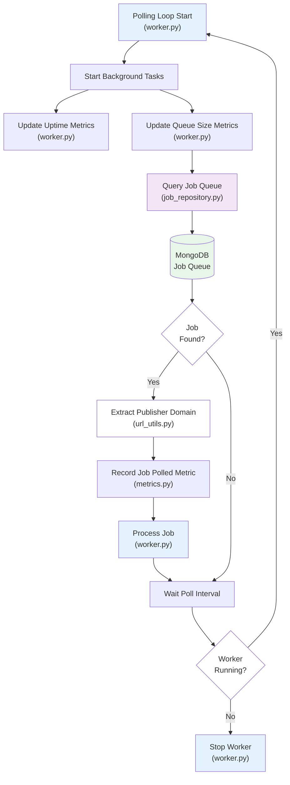
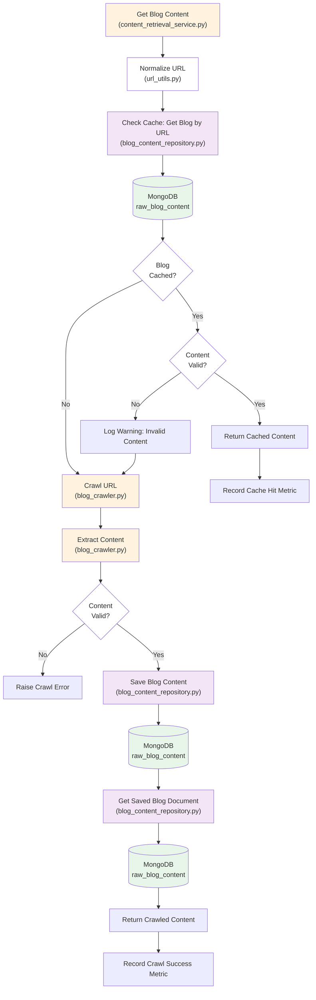
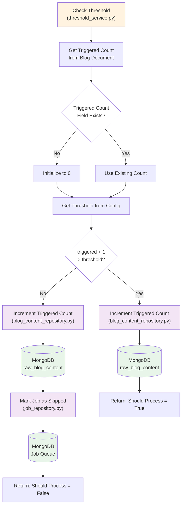
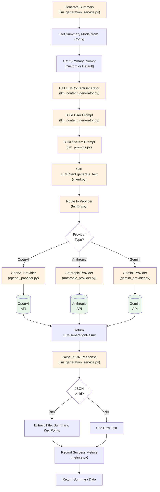
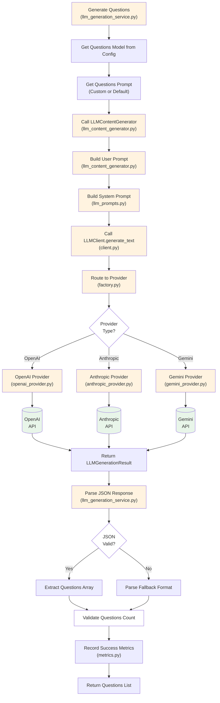
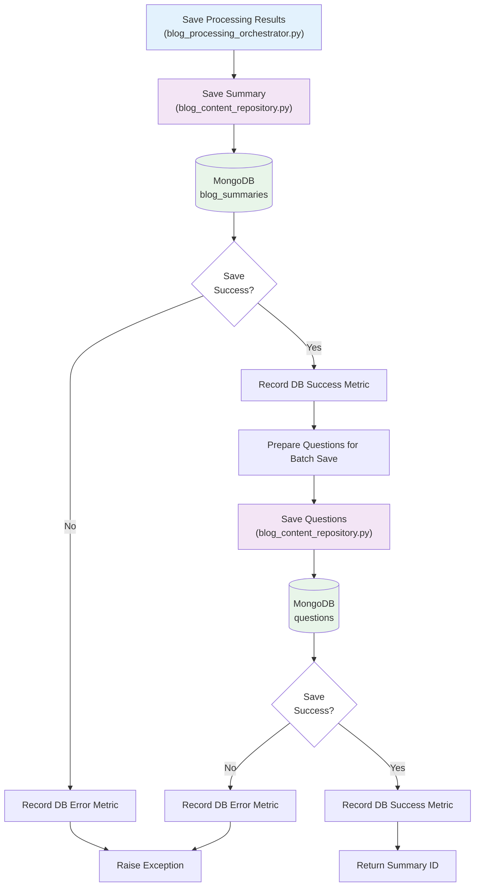
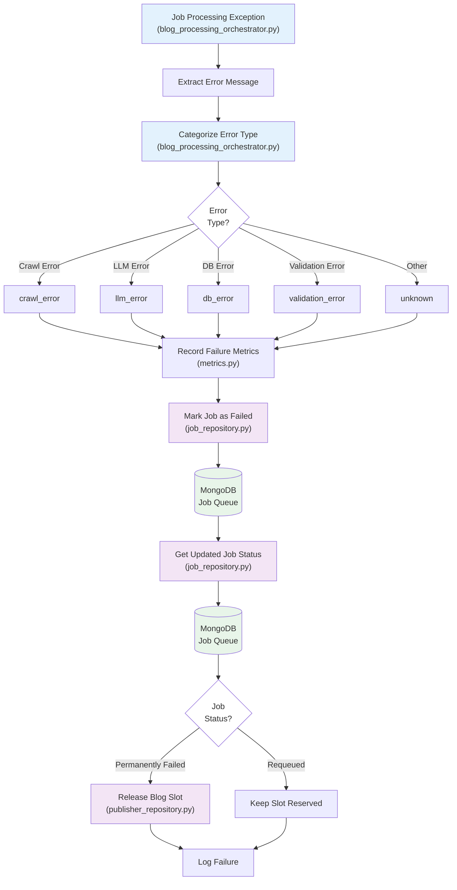

# Worker Service Flow Diagrams

This document provides visual flow diagrams for the Worker Service, showing how jobs are polled and processed step-by-step.

## Color Legend

- **Light Blue (#E3F2FD)**: Worker/Orchestrator Layer (main coordination)
- **Orange (#FFF3E0)**: Service Layer (business logic services)
- **Purple (#F3E5F5)**: Repository Layer (data access)
- **Light Green (#E8F5E9)**: Database/External Layer (MongoDB, PostgreSQL, LLM APIs)
- **White (#FFFFFF)**: Decision points and utility functions

---

## 1. Worker Startup Flow

```mermaid
graph TD
    A[Worker Startup<br/>&lpar;run_worker.py&rpar;] --> B[Load Configuration<br/>&lpar;config.py&rpar;]
    B --> C[Initialize BlogProcessingWorker<br/>&lpar;worker.py&rpar;]
    C --> D[Connect to MongoDB<br/>&lpar;database.py&rpar;]
    D --> E[(MongoDB<br/>Connection)]
    E --> F[Connect to PostgreSQL<br/>&lpar;publisher_repository.py&rpar;]
    F --> G[(PostgreSQL<br/>Connection)]
    G --> H[Initialize BlogCrawler<br/>&lpar;blog_crawler.py&rpar;]
    H --> I[Initialize LLMContentGenerator<br/>&lpar;llm_content_generator.py&rpar;]
    I --> J[Initialize BlogContentRepository<br/>&lpar;blog_content_repository.py&rpar;]
    J --> K[Initialize JobRepository<br/>&lpar;job_repository.py&rpar;]
    K --> L[Initialize PublisherRepository<br/>&lpar;publisher_repository.py&rpar;]
    L --> M[Initialize ContentRetrievalService<br/>&lpar;content_retrieval_service.py&rpar;]
    M --> N[Initialize ThresholdService<br/>&lpar;threshold_service.py&rpar;]
    N --> O[Initialize LLMGenerationService<br/>&lpar;llm_generation_service.py&rpar;]
    O --> P[Initialize BlogProcessingService<br/>&lpar;blog_processing_service.py&rpar;]
    P --> Q[Initialize BlogProcessingOrchestrator<br/>&lpar;blog_processing_orchestrator.py&rpar;]
    Q --> R[Start Metrics Server<br/>&lpar;metrics_server.py&rpar;]
    R --> S[Start Polling Loop<br/>&lpar;worker.py&rpar;]

    style A fill:#E3F2FD
    style C fill:#E3F2FD
    style S fill:#E3F2FD
    style B fill:#FFF3E0
    style D fill:#FFF3E0
    style F fill:#FFF3E0
    style H fill:#FFF3E0
    style I fill:#FFF3E0
    style M fill:#FFF3E0
    style N fill:#FFF3E0
    style O fill:#FFF3E0
    style P fill:#FFF3E0
    style Q fill:#FFF3E0
    style R fill:#FFF3E0
    style J fill:#F3E5F5
    style K fill:#F3E5F5
    style L fill:#F3E5F5
    style E fill:#E8F5E9
    style G fill:#E8F5E9
```

---

## 2. Polling Loop Flow

---

## 3. Job Processing Flow (Complete Pipeline)

```mermaid
graph TD
    A[Process Job<br/>&lpar;blog_processing_service.py&rpar;] --> B[Delegates to Orchestrator<br/>&lpar;blog_processing_orchestrator.py&rpar;]
    B --> C[Start Processing Timer]
    C --> D[Extract Publisher Domain<br/>&lpar;url_utils.py&rpar;]
    D --> E[Increment Active Jobs Metric]
    E --> F[Normalize URL<br/>&lpar;url_utils.py&rpar;]
    F --> G[Get Publisher Config<br/>&lpar;blog_processing_orchestrator.py&rpar;]
    G --> H[Get Publisher by Domain<br/>&lpar;publisher_repository.py&rpar;]
    H --> I[(PostgreSQL<br/>Publishers)]
    I --> J{Publisher<br/>Found?}
    J -->|Yes| K[Use Publisher Config]
    J -->|No| L[Use Default Config]
    K --> M[Get Blog Content<br/>&lpar;content_retrieval_service.py&rpar;]
    L --> M
    M --> N[Check Threshold<br/>&lpar;threshold_service.py&rpar;]
    N --> O{Threshold<br/>Met?}
    O -->|No| P[Mark Job as Skipped<br/>&lpar;job_repository.py&rpar;]
    P --> Q[(MongoDB<br/>Job Queue)]
    Q --> R[Release Blog Slot<br/>&lpar;publisher_repository.py&rpar;]
    R --> S[Return]
    O -->|Yes| T[Generate Summary<br/>&lpar;llm_generation_service.py&rpar;]
    T --> U[Generate Questions<br/>&lpar;llm_generation_service.py&rpar;]
    U --> V[Generate Embeddings<br/>&lpar;llm_generation_service.py&rpar;]
    V --> W[Save Processing Results<br/>&lpar;blog_processing_orchestrator.py&rpar;]
    W --> X[Mark Job as Completed<br/>&lpar;job_repository.py&rpar;]
    X --> Y[(MongoDB<br/>Job Queue)]
    Y --> Z[Record Success Metrics]
    Z --> AA[Track Publisher Usage<br/>&lpar;blog_processing_orchestrator.py&rpar;]
    AA --> AB[Release Blog Slot<br/>&lpar;publisher_repository.py&rpar;]
    AB --> S

    style A fill:#E3F2FD
    style B fill:#E3F2FD
    style G fill:#E3F2FD
    style W fill:#E3F2FD
    style AA fill:#E3F2FD
    style M fill:#FFF3E0
    style N fill:#FFF3E0
    style T fill:#FFF3E0
    style U fill:#FFF3E0
    style V fill:#FFF3E0
    style H fill:#F3E5F5
    style P fill:#F3E5F5
    style X fill:#F3E5F5
    style R fill:#F3E5F5
    style AB fill:#F3E5F5
    style D fill:#FFFFFF
    style F fill:#FFFFFF
    style J fill:#FFFFFF
    style O fill:#FFFFFF
    style I fill:#E8F5E9
    style Q fill:#E8F5E9
    style Y fill:#E8F5E9
```

---

## 4. Get Blog Content Flow (Content Retrieval)

---

## 5. Check Threshold Flow

---

## 6. Generate Summary Flow

---

## 7. Generate Questions Flow

---

## 8. Save Processing Results Flow

---

## 9. Job Failure Handling Flow

---

## Layer Summary

### Worker/Orchestrator Layer (Light Blue)
- `worker.py` - Main worker class, polling loop
- `blog_processing_service.py` - Service wrapper
- `blog_processing_orchestrator.py` - Pipeline orchestration

### Service Layer (Orange)
- `content_retrieval_service.py` - Blog content retrieval
- `threshold_service.py` - Threshold checking
- `llm_generation_service.py` - LLM content generation
- `llm_content_generator.py` - LLM abstraction
- `blog_crawler.py` - Web crawling

### Repository Layer (Purple)
- `job_repository.py` - Job queue operations
- `publisher_repository.py` - Publisher config operations
- `blog_content_repository.py` - Blog content storage

### Database/External Layer (Light Green)
- MongoDB - Job queue, blog content, summaries, questions
- PostgreSQL - Publisher configurations
- LLM APIs - OpenAI, Anthropic, Gemini

