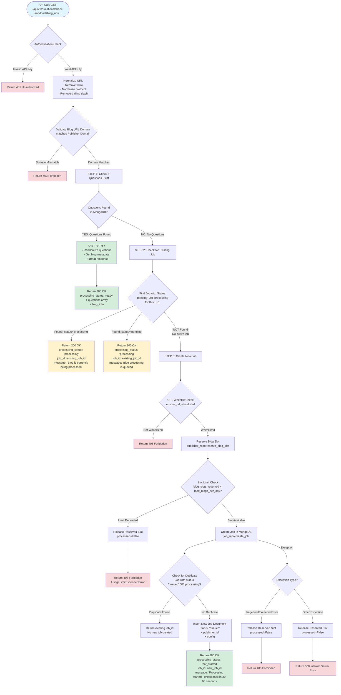

# Check-and-Load API Flow Diagram

## Key Conditions and Decision Points

### 1. Authentication & Authorization
- **Condition**: Valid X-API-Key header required
- **Failure**: Returns 401 Unauthorized

### 2. Domain Validation
- **Condition**: Blog URL domain must match publisher's registered domain
- **Failure**: Returns 403 Forbidden

### 3. Questions Existence Check
- **Condition**: `questions.length > 0` in MongoDB
- **Success Path**: Returns questions immediately (FAST PATH)
- **Failure Path**: Proceeds to job check

### 4. Active Job Check
- **Condition**: Job exists with status `'pending'` OR `'processing'`
- **Note**: `'skipped'` and `'failed'` jobs are NOT considered active
- **Success**: Returns existing job status
- **Failure**: Proceeds to create new job

### 5. URL Whitelist Check
- **Condition**: URL must be in publisher's `whitelisted_blog_urls` (if configured)
- **Failure**: Returns 403 Forbidden

### 6. Slot Reservation
- **Condition**: `blog_slots_reserved < max_blogs_per_day`
- **Failure**: Returns 403 Forbidden (UsageLimitExceededError)
- **Success**: Increments `blog_slots_reserved`

### 7. Duplicate Job Prevention
- **Condition**: Check for existing job with status `'queued'` OR `'processing'`
- **Note**: `'skipped'` jobs can be immediately requeued (not checked)
- **Success**: Returns existing job_id (no duplicate created)
- **Failure**: Creates new job

## Important Notes

1. **Skipped Jobs**: Can be immediately requeued (no delay/wait period)
2. **Failed Jobs**: Can be requeued (treated same as no job)
3. **Slot Management**: 
   - Reserved when job is created
   - Released when job is completed, failed, or skipped
4. **Error Handling**: If job creation fails after slot reservation, slot is automatically released

## Response States

- `ready`: Questions exist and are returned
- `processing`: Job is pending or currently processing
- `not_started`: New job was just created

